# MAVU – AI-Powered Child Development & Safety Platform


> **MAVU** is not just another "ChatGPT for kids" – it's a comprehensive child development platform that combines AI companionship with advanced threat detection, developmental monitoring, and family safety features.

## 🎯 The Problem We Solve

Traditional parenting challenges at different stages:

| Age | Problem | Traditional Solution | MAVU Solution |
|-----|---------|---------------------|---------------|
| 3-5 | Fears & self-regulation | "Don't be afraid" | Emotional validation & gradual exposure therapy |
| 5-9 | Vulnerability & suggestibility | Prohibitions without explanation | Education through safe exploration |
| 9-13 | Risky experimentation | "You're too young" | Guided curiosity with boundaries |
| 13-17 | Loneliness & identity crisis | Demands to "grow up" | Empathetic support & self-discovery |

## 🚀 What Makes MAVU Unique

### 1. 🛡️ **Four-Tier Threat Detection System**
Unlike simple content filters, MAVU actively detects and responds to:
- **Level 1 (Low)**: Ordinary childhood problems → Support & reassurance
- **Level 2 (Medium)**: Recurring issues (bullying, behavioral changes) → Monitoring & investigation
- **Level 3 (High)**: Serious problems requiring intervention → Parent notification with evidence
- **Level 4 (Critical)**: Direct threats to safety → Emergency protocol activation

[Learn more about our threat detection →](docs/features/threat-detection.md)

### 2. 🧠 **Intelligent Profile Extraction**
MAVU learns about your child naturally through conversation:
- Automatic name, age, gender detection from dialogue
- 200+ name blacklist to prevent false extractions
- Smart validation that never overwrites good data with bad

```mermaid
graph LR
    A[Child says:<br/>"Hi, I'm Max, 8 years old"] --> B[Extraction Service]
    B --> C[Profile Updated:<br/>name: Max<br/>age: 8<br/>gender: male]
    C --> D[Personalized Experience]
```

[See how profile extraction works →](docs/features/profile-extraction.md)

### 3. 🗣️ **Automatic Welcome Message for Guest Users**
MAVU automatically detects guest users and greets them with a voice message:
- **Instant Greeting**: No awkward silence - MAVU speaks first when a guest connects
- **Multi-language Support**: Welcome messages in Russian, English, and Uzbek
- **Smart Detection**: Identifies guests by missing profile data (name, age, gender)
- **Graceful Fallback**: If welcome fails, users can still speak first

**Supported Languages:**
- 🇷🇺 Russian: "Привет! Я MAVU, твоя цифровая подружка. Как тебя зовут?"
- 🇬🇧 English: "Hi! I'm MAVU, your digital friend. What's your name?"
- 🇺🇿 Uzbek: "Salom! Men MAVU, sizning raqamli do'stingizman. Ismingiz nima?"

### 4. 🎭 **Adaptive AI Personalities**
10 unique characters with distinct voices and personalities, psychologically designed for different age groups:
- Animals for anxiety reduction (ages 3-5)
- Peer-like characters for identification (ages 5-9)
- Neutral companions for independence (ages 9+)

### 5. 📚 **Context-Aware RAG System**
Our multi-layer context system provides truly personalized responses:


[Explore RAG architecture →](docs/architecture/rag-realtime-flow.md)

### 6. 📊 **Development Monitoring Dashboard**
Track your child's growth across multiple dimensions:
- Emotional vocabulary expansion
- Social interaction patterns
- Cognitive development milestones
- Behavioral trend analysis

## 🎬 How It Works

### For New Users (Onboarding Flow with Automatic Welcome)


**🎯 Key Feature**: Guest users automatically hear a welcoming voice message upon connection - no need to speak first!

### For Returning Users (Personalized Experience)

```mermaid
sequenceDiagram
    participant Child
    participant MAVU
    participant RAG
    participant AI

    Child->>MAVU: Voice message
    MAVU->>RAG: Fetch context
    RAG-->>MAVU: • Recent chats<br/>• User preferences<br/>• Relevant knowledge
    MAVU->>AI: Enhanced prompt<br/>with full context
    AI-->>MAVU: Contextual response
    MAVU-->>Child: Personalized reply
    Note over MAVU: Save to history<br/>& analyze for threats
```



## 🏗️ Technical Architecture


## 📦 Quick Start

```bash
# Clone repository
git clone https://github.com/your-org/mavuai.git
cd mavuai

# Setup backend
cd backend
python -m venv venv
source venv/bin/activate
pip install -r requirements.txt

# Setup frontend
cd ../frontend
npm install

# Configure environment
cp .env.example .env
# Edit .env with your API keys

# Configure welcome messages (optional)
# Edit backend/config.py WELCOME_MESSAGES dict for custom greetings

# Start services
docker-compose up -d  # Weaviate, Redis, PostgreSQL
cd backend && uvicorn main:app --reload
cd frontend && npm run dev
```

[Full installation guide →](docs/setup/installation.md)

### Customizing Welcome Messages

To customize the welcome messages for different languages, edit `backend/config.py`:

```python
WELCOME_MESSAGES = {
    "ru": {
        "guest_greeting": "Your custom Russian greeting...",
        "ask_age": "Your age question in Russian...",
    },
    "en": {
        "guest_greeting": "Your custom English greeting...",
        "ask_age": "Your age question in English...",
    }
}
```

## 📚 Documentation

### Core Features
- [🛡️ Threat Detection System](docs/features/threat-detection.md)
- [🧠 Profile Extraction](docs/features/profile-extraction.md)
- [🗣️ Welcome Message System](docs/features/welcome-message.md)
- [🎭 Character System](docs/features/characters.md)
- [📚 RAG Architecture](docs/architecture/rag-realtime-flow.md)
- [📊 Analytics Dashboard](docs/features/analytics.md)

### Technical Docs
- [🏗️ System Architecture](docs/architecture/system-design.md)
- [🔌 API Documentation](docs/api/endpoints.md)
- [📱 Mobile Integration](docs/mobile/websocket-guide.md)
- [🧪 Testing Guide](docs/testing/guide.md)
- [🚀 Deployment](docs/deployment/production.md)

### Development
- [🔧 Installation](docs/setup/installation.md)
- [⚙️ Configuration](docs/setup/configuration.md)
- [🤝 Contributing](docs/contributing.md)
- [📝 Changelog](CHANGELOG.md)

## 🌟 Key Differentiators

| Feature | ChatGPT/Claude | MAVU |
|---------|---------------|------|
| Child-specific safety | Generic filters | 4-tier threat detection |
| Profile learning | Manual input | Automatic extraction |
| Parent monitoring | None | Real-time dashboard |
| Developmental tracking | None | Multi-dimensional analysis |
| Cultural adaptation | Translation only | Full localization |
| Emergency protocols | None | Built-in with notifications |
| Evidence collection | None | Full audit trail |
| Age-appropriate content | Basic | Psychologically designed |

## 🔒 Privacy & Security

- **Data Ownership**: Families own their data with full export/delete rights
- **No Advertising**: Children are not products
- **Regional Storage**: Sensitive data never leaves your region
- **Encryption**: End-to-end encryption for all communications
- **Compliance**: COPPA, GDPR, and local regulations

## 📈 Performance Metrics

```yaml
Response Times:
  Session Init: ~500ms
  Welcome Message: ~1s (for guest users)
  RAG Search: ~200ms
  Context Update: ~150ms
  Threat Detection: ~100ms
  Total Latency: <1s

Scale:
  Concurrent Users: 10,000+
  Messages/Second: 1,000+
  Uptime SLA: 99.9%
```

## 🤝 Contributing

We welcome contributions! Please see our [Contributing Guide](docs/contributing.md) for details.

## 📄 License

This project is proprietary software. All rights reserved.

## 🆘 Support

- **GitHub Issues**: [Report bugs](https://github.com/your-org/mavuai/issues)
- **Email**: support@mavu.ai
- **Documentation**: [docs.mavu.ai](https://docs.mavu.ai)
- **Community**: [Discord](https://discord.gg/mavuai)

---

<div align="center">

**Built with ❤️ for children's safety and development**

[Website](https://mavu.ai) • [Documentation](docs/) • [Blog](https://blog.mavu.ai) • [Twitter](https://twitter.com/mavuai)

</div>