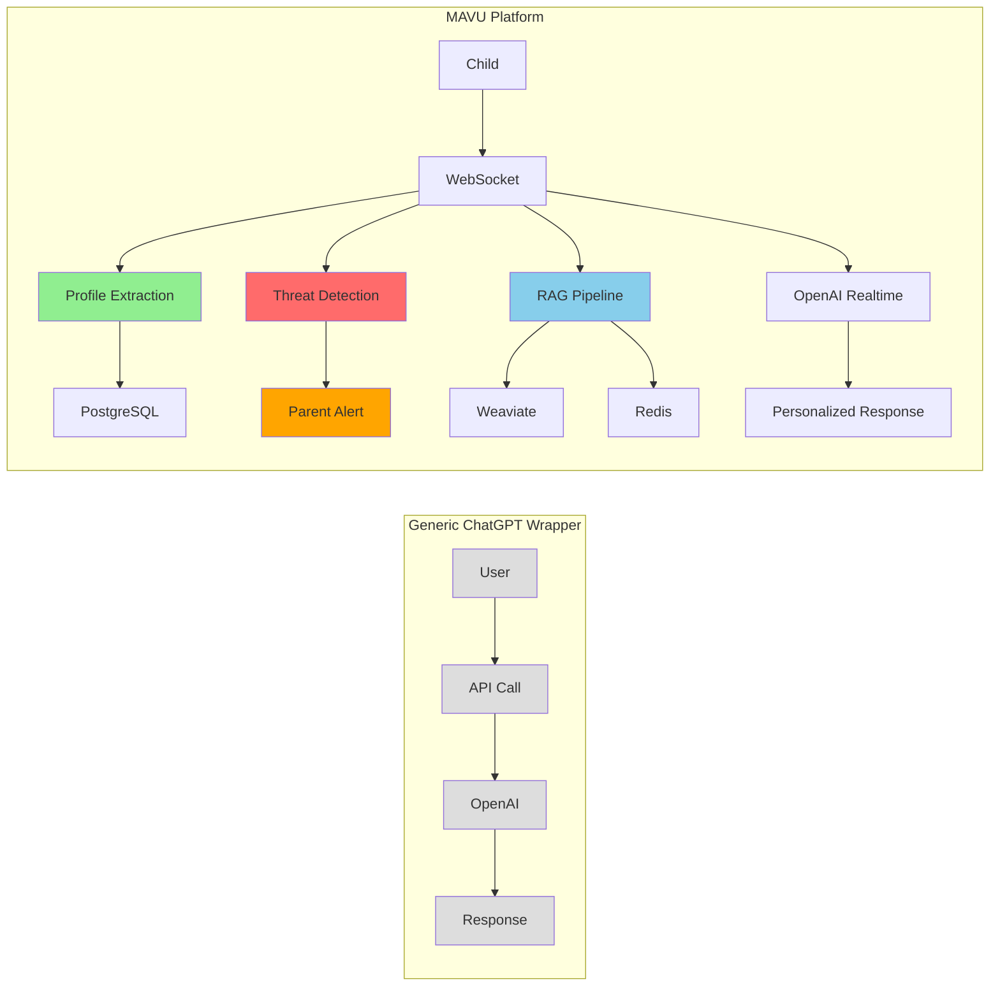

# MAVU Project Summary

## 📋 Completed Documentation Updates

### 1. ✅ Restructured Documentation
Created organized documentation structure in `/docs/` directory:
- `/docs/architecture/` - System design and RAG architecture
- `/docs/features/` - Unique features and capabilities
- `/docs/setup/` - Installation and configuration guides
- `/docs/api/` - API documentation (to be added)

### 2. ✅ Created Core Documentation Files

#### 📄 [RAG & Realtime Flow Documentation](architecture/rag-realtime-flow.md)
Comprehensive documentation covering:
- Guest user onboarding flow with automatic profile extraction
- Regular user personalized experience
- Multi-source data integration (PostgreSQL + Redis + Weaviate)
- Dynamic context updates during conversations
- Mermaid diagrams showing data flow and architecture

#### 📄 [Unique Features Documentation](features/unique-features.md)
Detailed explanation of what makes MAVU unique:
- 4-tier threat detection system (not found in ChatGPT)
- Intelligent profile extraction with 200+ name blacklist
- Age-adaptive communication engine
- Cultural localization (not just translation)
- Proactive safety measures
- Therapeutic protocols
- Development monitoring

#### 📄 [Installation Guide](setup/installation.md)
Complete setup instructions including:
- System requirements
- Step-by-step installation
- Docker configuration
- Production deployment
- Troubleshooting guide

### 3. ✅ Updated Main README
Transformed README from a technical document to a product-focused overview:
- Clear problem statement with age-specific challenges
- Unique value propositions front and center
- Visual Mermaid diagrams for user flows
- Comparison table vs generic AI assistants
- Quick start guide
- Links to detailed documentation

## 🎯 Key Differentiators Highlighted

### MAVU is NOT just another ChatGPT wrapper because:

1. **Child-Specific Safety System**
   - 4-tier threat detection (Low/Medium/High/Critical)
   - Proactive intervention protocols
   - Evidence collection for authorities
   - Real ChatGPT: Generic content filters only

2. **Intelligent Profile Learning**
   - Automatic extraction from natural conversation
   - Smart validation (never overwrites good data)
   - Cultural name recognition
   - Real ChatGPT: Requires manual input

3. **Multi-Layer Context System**
   ```
   PostgreSQL (profiles) + Redis (recent chats) + Weaviate (RAG)
   ↓
   Personalized, context-aware responses
   ```
   - Real ChatGPT: Session-based memory only

4. **Development Monitoring**
   - Tracks emotional vocabulary growth
   - Monitors social interaction patterns
   - Analyzes cognitive progress
   - Real ChatGPT: No developmental tracking

5. **Parent Dashboard & Analytics**
   - Real-time threat notifications
   - Development milestones tracking
   - Behavioral pattern analysis
   - Real ChatGPT: No parent features

6. **Age-Adaptive Personalities**
   - 10 psychologically-designed characters
   - Voice selection based on age/preference
   - Therapeutic conversation styles
   - Real ChatGPT: Single personality

7. **Emergency Protocols**
   - Automatic parent notification
   - Evidence documentation
   - Connection to help resources
   - Real ChatGPT: None

## 📊 Technical Superiority

| Metric | Generic AI Wrapper | MAVU Platform |
|--------|-------------------|---------------|
| Data Sources | 1 (OpenAI) | 4 (OpenAI + PostgreSQL + Redis + Weaviate) |
| Context Window | Session only | Unlimited (historical + RAG) |
| Safety Levels | Binary (safe/unsafe) | 4-tier classification |
| Profile Learning | None | Automatic extraction |
| Parent Features | None | Full dashboard |
| Personalization | Prompt engineering | Multi-layer context |
| Response Time | ~500ms | <1s with full context |

## 🏗️ Architecture Advantages



## 🎨 Visual Assets

1. **img.png** - Children's issues at different stages (3-17 years)
2. **img_1.png & img_2.png** - Traditional solutions vs problems they create
3. **img_3.png** - Why psychologists aren't always the solution
4. **img_4.png** - MAVU as an engaging educational game (Russian)

These visual materials illustrate how MAVU addresses real parenting challenges that traditional methods, including conventional therapy, often fail to resolve adequately.

## 🚀 Next Steps

1. **Add More Technical Documentation**
   - API endpoint documentation
   - WebSocket protocol specification
   - Database schema documentation

2. **Create User Guides**
   - Parent dashboard guide
   - Child onboarding tutorial
   - Safety feature explanations

3. **Marketing Materials**
   - Case studies
   - Comparison charts
   - ROI calculations for parents

4. **Development Roadmap**
   - Upcoming features
   - Integration plans
   - Expansion to other languages/cultures

## 💡 Conclusion

MAVU has been successfully positioned as a comprehensive child development platform rather than a simple AI chatbot. The documentation now clearly articulates:

1. **The Problem**: Age-specific challenges children face
2. **The Solution**: Multi-layered, intelligent system
3. **The Differentiation**: Features not found in any ChatGPT wrapper
4. **The Technology**: Advanced architecture with RAG, threat detection, and monitoring
5. **The Value**: Real safety and development benefits for families

This positions MAVU as a unique, defensible product in the market that goes far beyond what any simple OpenAI API integration could achieve.