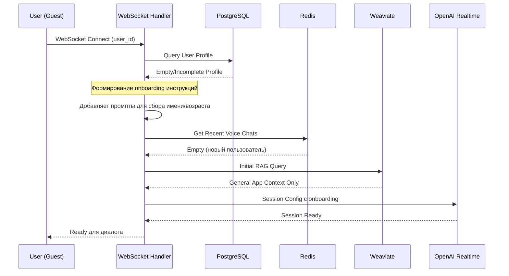
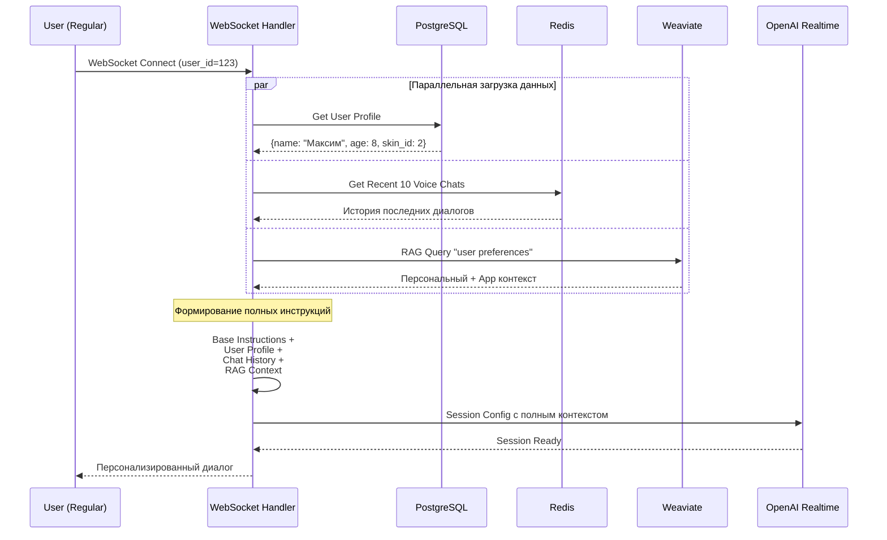
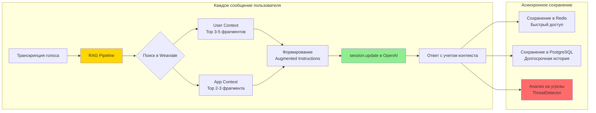
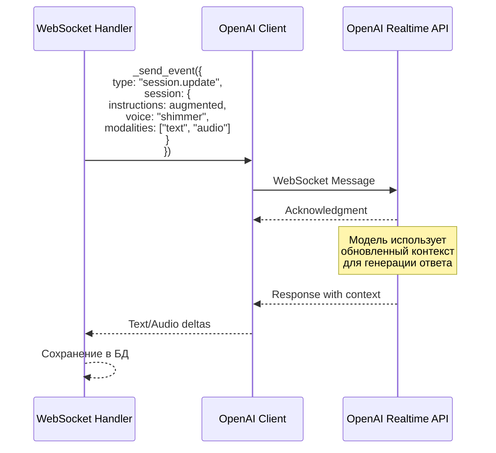

# RAG и Chat History в Realtime сессии MAVU

## Обзор архитектуры

MAVU использует многоуровневую систему контекста для создания персонализированного опыта общения. В отличие от простых ChatGPT-оберток, наша система интегрирует:

- **PostgreSQL**: Профили пользователей и долгосрочная история
- **Redis**: Быстрый доступ к последним диалогам
- **Weaviate**: Векторная БД для семантического поиска и RAG
- **OpenAI Realtime API**: Голосовое общение в реальном времени

## Поток для нового пользователя (Guest)

### Фаза 1: Первичная инициализация



### Фаза 2: Сбор информации о госте

```mermaid
flowchart TD
    A[Guest подключается] --> B{Профиль полный?}
    B -->|Нет| C[Активация onboarding режима]
    C --> D[Добавление в инструкции:<br/>- Вопросы о имени<br/>- Вопросы о возрасте<br/>- Дружелюбный тон]

    D --> E[Начало диалога]
    E --> F[User: "Привет!"]
    F --> G[MAVU: "Привет! Я MAVU.<br/>Как тебя зовут?"]

    G --> H[User: "Меня зовут Максим"]
    H --> I[Извлечение имени<br/>UserInfoExtractionService]
    I --> J[Обновление профиля]

    J --> K[MAVU: "Приятно познакомиться, Максим!<br/>Сколько тебе лет?"]
    K --> L[User: "Мне 8 лет"]
    L --> M[Извлечение возраста]
    M --> N[Профиль заполнен]

    N --> O[Обновление системных инструкций]
    O --> P[Переход в обычный режим]

    style C fill:#ffd700
    style I fill:#90ee90
    style M fill:#90ee90
    style N fill:#87ceeb
```

### Особенности извлечения информации

```python
# backend/services/user_info_extraction_service.py

class UserInfoExtractionService:
    # 200+ имен в черном списке для фильтрации
    NAME_BLACKLIST = ["привет", "пока", "да", "нет", ...]

    # Умная валидация:
    # 1. Regex паттерны для русских/английских имен
    # 2. GPT-4 fallback для сложных случаев
    # 3. Определение пола по имени
    # 4. Возраст 3-99 лет
```

## Поток для зарегистрированного пользователя (Regular)

### Фаза 1: Инициализация с полным контекстом



### Фаза 2: Динамическое обновление контекста



## Структура данных в системе

### 1. PostgreSQL - Профиль пользователя

```python
class User:
    id: int
    name: str          # Извлекается автоматически
    age: int           # Извлекается автоматически
    gender: str        # Определяется по имени
    skin_id: int       # Выбранный персонаж
    created_at: datetime
    updated_at: datetime
```

### 2. Redis - Быстрая история

```json
{
  "user:123:voice_chats": [
    {
      "role": "user",
      "message": "Привет, MAVU!",
      "timestamp": "2024-12-09T10:00:00Z"
    },
    {
      "role": "assistant",
      "message": "Привет, Максим! Как твои дела?",
      "timestamp": "2024-12-09T10:00:05Z"
    }
  ]
}
```

### 3. Weaviate - RAG контексты

```mermaid
graph TD
    subgraph "UserContext Collection"
        UC1[Текст: "Максим любит играть в футбол"]
        UC2[Текст: "У Максима есть собака по имени Рекс"]
        UC3[Текст: "Максим боится темноты"]
    end

    subgraph "AppContext Collection"
        AC1[Текст: "Советы по преодолению страха темноты"]
        AC2[Текст: "Игры для детей 7-9 лет"]
        AC3[Текст: "Безопасность в интернете"]
    end

    Q[Query: "расскажи про собак"] -.->|Векторный поиск| UC2
    Q -.->|Гибридный поиск| AC2

    style UC2 fill:#90ee90
    style AC2 fill:#87ceeb
```

## Формирование системных инструкций

### Базовая структура

```typescript
const systemInstructions = `
${baseInstructions}        // Основные правила MAVU

${userProfile}              // Имя, возраст, предпочтения
${onboardingSection}        // Только для новых пользователей

Recent Conversation History:
${chatHistory}              // Последние 6 сообщений из Redis

<context>
User Context:
${userContext}              // Top 3 из Weaviate UserContext

Application Knowledge:
${appContext}               // Top 3 из Weaviate AppContext
</context>
`;
```

### Пример готовых инструкций

```text
You are MAVU, a friendly AI companion for children.

User Profile:
- Name: Максим
- Age: 8 years
- Gender: male
- Preferences: Loves football, has a dog named Rex

Recent Conversation History:
User: Привет!
Assistant: Привет, Максим! Как прошел твой день?
User: Хорошо, играл с Рексом

<context>
User Context:
- У Максима есть собака по имени Рекс
- Максим любит играть в футбол
- Максим учится во 2 классе

Application Knowledge:
- Игры с собаками полезны для развития эмпатии
- Физическая активность важна для детей 7-9 лет
</context>

Use the above context to provide personalized responses.
```

## Отправка в OpenAI Realtime API



## Ключевые преимущества архитектуры

### 1. Персонализация без потери производительности
- Redis кеш для быстрого доступа к истории
- Асинхронное обновление контекста
- Параллельная загрузка из всех источников

### 2. Безопасность и мониторинг
- Каждое сообщение анализируется на угрозы
- История сохраняется для родительского контроля
- Контекст фильтруется по возрасту

### 3. Масштабируемость
- Weaviate для семантического поиска в больших объемах
- Redis для горизонтального масштабирования
- Stateless WebSocket handlers

### 4. Graceful Degradation
- Работает без Weaviate (базовый режим)
- Работает без Redis (без быстрой истории)
- Fallback на базовые инструкции при сбоях

## Метрики производительности

```python
# Типичные показатели системы:
- Инициализация сессии: ~500ms
- RAG поиск: ~200ms
- Обновление контекста: ~150ms
- Сохранение в БД: ~50ms (async)
- Общая задержка: < 1s
```

## Заключение

MAVU - это не просто "ChatGPT для детей", а комплексная платформа с:

1. **Умным onboarding** - автоматический сбор информации
2. **Многоуровневым контекстом** - БД + Redis + Weaviate
3. **Динамической персонализацией** - обновление на каждом сообщении
4. **Безопасностью** - анализ угроз и мониторинг
5. **Адаптивностью** - подстройка под возраст и развитие

Эта архитектура обеспечивает уникальный опыт для каждого ребенка, сохраняя при этом высокую производительность и безопасность.