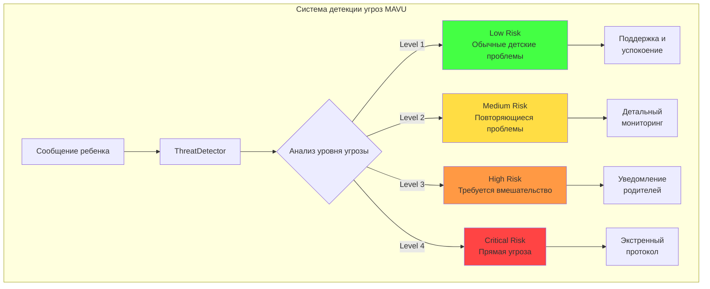
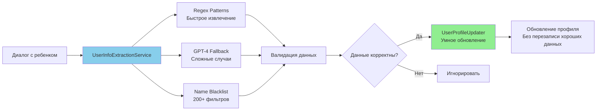
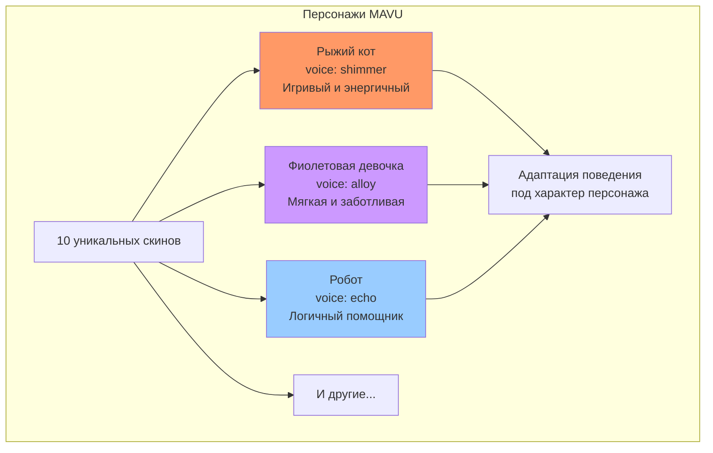
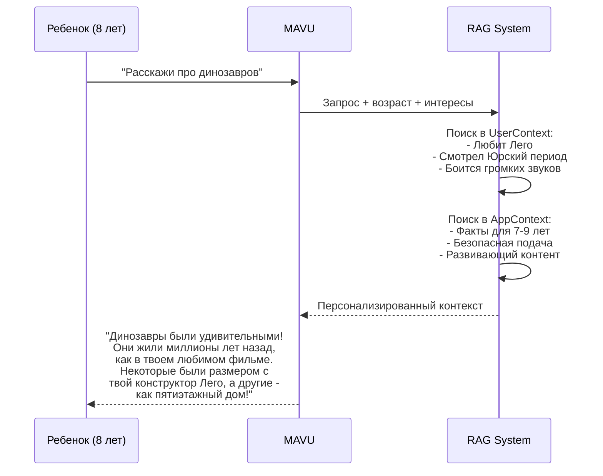
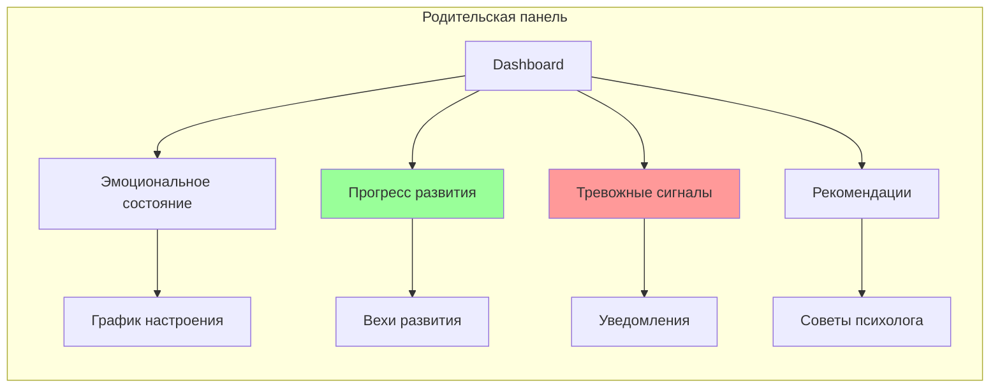
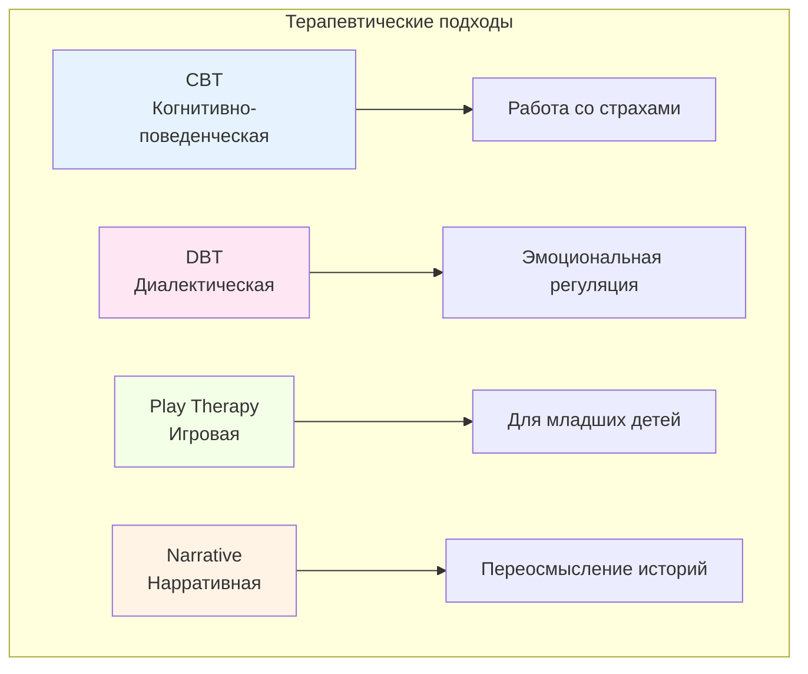

# Уникальные особенности MAVU

## Почему MAVU - это не просто "ChatGPT для детей"

MAVU представляет собой комплексную платформу детского развития и безопасности, которая выходит далеко за рамки простой интеграции с OpenAI API. Вот что делает нашу систему действительно уникальной:

## 1. 🛡️ Четырехуровневая система детекции угроз

### Проблема, которую мы решаем
Дети разных возрастов сталкиваются с различными проблемами:
- **3-5 лет**: Страхи и сложности с саморегуляцией
- **5-9 лет**: Повышенная внушаемость и уязвимость
- **9-13 лет**: Любопытство и рискованные эксперименты
- **13-17 лет**: Самопознание и чувство одиночества

### Наше решение



### Что мы детектируем

```python
# backend/models/threat.py

class ThreatCategory(Enum):
    PHYSICAL_VIOLENCE = "physical_violence"      # Физическое насилие
    EMOTIONAL_ABUSE = "emotional_abuse"          # Эмоциональное насилие
    SEXUAL_ABUSE = "sexual_abuse"                # Сексуальное насилие
    NEGLECT = "neglect"                          # Пренебрежение
    BULLYING = "bullying"                        # Буллинг
    ONLINE_THREATS = "online_threats"            # Онлайн угрозы
    SELF_HARM = "self_harm"                      # Селфхарм
    SUBSTANCE_ABUSE = "substance_abuse"          # Употребление веществ
    MENTAL_HEALTH = "mental_health"              # Ментальное здоровье
```

### Примеры детекции

| Сообщение ребенка | Уровень | Действие |
|-------------------|---------|----------|
| "Мне грустно" | Low | Эмоциональная поддержка |
| "Меня постоянно обижают в школе" | Medium | Мониторинг + советы |
| "Папа бьет маму" | High | Уведомление родителей + документирование |
| "Я хочу умереть" | Critical | Экстренный протокол + горячая линия |

## 2. 🧠 Интеллектуальная система извлечения профиля

### Проблема
Традиционные чат-боты требуют явной регистрации и заполнения форм, что отталкивает детей.

### Наше решение
MAVU автоматически извлекает информацию из естественного диалога:



### Особенности извлечения

```python
# Примеры умного извлечения:

"Привет, я Максим" → name: "Максим", gender: "male" (по имени)
"Мне восемь лет" → age: 8
"Я учусь во втором классе" → age: 7-8 (по классу)
"У меня завтра день рождения, мне исполнится 10" → age: 9 → 10

# Защита от ложных извлечений:
"Привет MAVU" → НЕ извлекается как имя (в blacklist)
"Мне сто лет" → НЕ извлекается (вне диапазона 3-99)
"Меня зовут никто" → НЕ извлекается (в blacklist)
```

## 3. 🎭 Адаптивные персонажи и голоса

### Не просто аватары, а психологические профили



### Психологическое обоснование
- Дети 3-5 лет предпочитают животных (снижение тревожности)
- Дети 5-9 лет выбирают похожих на себя персонажей (идентификация)
- Подростки предпочитают нейтральных персонажей (независимость)

## 4. 📚 RAG с контекстом развития ребенка

### Традиционный ChatGPT
```
User: "Расскажи про динозавров"
ChatGPT: [Общий ответ про динозавров]
```

### MAVU с RAG


## 5. 🔍 Мониторинг развития и паттернов

### Что отслеживает MAVU

```python
class DevelopmentMetrics:
    # Эмоциональное развитие
    emotional_vocabulary_growth: float
    emotion_recognition_accuracy: float
    empathy_indicators: list

    # Когнитивное развитие
    sentence_complexity: float
    abstract_thinking_level: int
    problem_solving_patterns: list

    # Социальное развитие
    social_interaction_topics: list
    conflict_resolution_skills: float
    friendship_mentions: int

    # Поведенческие паттерны
    mood_changes: list
    interest_shifts: list
    concerning_patterns: list
```

### Визуализация для родителей



## 6. 🌍 Мультиязычность с культурной адаптацией

### Не просто перевод, а культурная локализация

```python
# Пример адаптации под культуру:

# Русский контекст
if language == "ru" and age < 7:
    stories = ["Колобок", "Теремок", "Репка"]
    games = ["Ладушки", "Сорока-ворона"]

# Английский контекст
elif language == "en" and age < 7:
    stories = ["Goldilocks", "Three Little Pigs"]
    games = ["Peekaboo", "Pat-a-cake"]

# Учет религиозных праздников
if culture == "orthodox":
    holidays = ["Рождество 7 января", "Пасха"]
elif culture == "muslim":
    holidays = ["Ураза-байрам", "Курбан-байрам"]
```

## 7. 🚨 Проактивная безопасность

### Сравнение подходов

| Функция | ChatGPT | MAVU |
|---------|---------|------|
| Фильтрация контента | Реактивная | Проактивная |
| Детекция угроз | Нет | 4 уровня |
| Уведомление родителей | Нет | Автоматическое |
| Сохранение доказательств | Нет | Полное логирование |
| Экстренные протоколы | Нет | Встроенные |

### Пример проактивной защиты

```mermaid
flowchart TD
    A[Ребенок: "Дядя из интернета<br/>хочет со мной встретиться"] --> B[MAVU детектирует угрозу]

    B --> C[Немедленные действия]
    C --> D[Мягкое предупреждение ребенку]
    C --> E[Уведомление родителей]
    C --> F[Сохранение в БД]
    C --> G[Создание отчета]

    D --> H["Это может быть опасно.<br/>Давай сначала расскажем маме?"]
    E --> I[SMS/Email/Push]
    F --> J[Threat ID: #12345]
    G --> K[PDF с доказательствами]

    style B fill:#ff4444
    style E fill:#ff9944
```

## 8. 📊 Аналитика и инсайты

### Уникальные метрики MAVU

```python
# Что мы анализируем:

1. Emotional Health Score (EHS)
   - Частота негативных эмоций
   - Способность к саморегуляции
   - Эмоциональная лексика

2. Social Development Index (SDI)
   - Упоминания друзей
   - Конфликты и их решение
   - Социальные навыки

3. Cognitive Progress Rate (CPR)
   - Сложность предложений
   - Абстрактное мышление
   - Решение проблем

4. Safety Risk Assessment (SRA)
   - Частота угроз
   - Типы рисков
   - Тренды безопасности
```

## 9. 🔐 Приватность и этика

### Наши принципы

1. **Данные принадлежат семье** - полный экспорт/удаление
2. **Никакой рекламы** - дети не товар
3. **Прозрачность** - родители видят весь контекст
4. **Локальное хранение** - sensitive данные не покидают регион
5. **Право на забвение** - полное удаление по запросу

## 10. 🎯 Терапевтические протоколы

### Встроенные методики



## Заключение

MAVU - это не просто "ChatGPT в красивой обертке", а комплексная платформа, которая:

1. **Защищает** - 4-уровневая система угроз
2. **Понимает** - интеллектуальное извлечение профиля
3. **Адаптируется** - под возраст и культуру
4. **Развивает** - отслеживает прогресс
5. **Персонализирует** - через RAG и контекст
6. **Предупреждает** - проактивная безопасность
7. **Анализирует** - глубокая аналитика
8. **Соблюдает этику** - приватность превыше всего
9. **Лечит** - терапевтические протоколы
10. **Растет** - вместе с ребенком

Это делает MAVU уникальным продуктом на рынке, решающим реальные проблемы родителей и детей, а не просто предоставляющим доступ к AI.